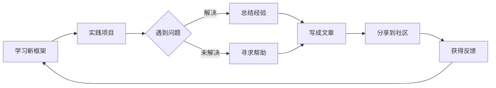

# 你好，我是 Cai Zhenxin！ 👨‍💻

一名热爱技术的前端开发者，专注于 Web 开发和用户体验。我相信技术的力量可以改变世界，而代码是实现这一目标的最佳工具。

## 🎯 我的使命

通过技术解决实际问题，创造有价值的产品，并在不断学习中成长。我希望通过这个博客记录学习历程，分享技术见解，并与社区共同进步。

## 🛠️ 技术专长

### 前端技术栈
- **框架**: Vue 3, React, TypeScript
- **构建工具**: Vite, Webpack, Rollup
- **样式方案**: Tailwind CSS, Sass, CSS-in-JS
- **状态管理**: Pinia, Vuex, Zustand
- **测试框架**: Vitest, Jest, Cypress

### 后端技能
- **运行时**: Node.js, Deno
- **框架**: Express, Koa, NestJS
- **数据库**: MongoDB, PostgreSQL, Redis
- **API 设计**: RESTful, GraphQL

### DevOps 工具链
- **CI/CD**: GitHub Actions, Jenkins, GitLab CI
- **容器化**: Docker, Docker Compose
- **部署**: Kubernetes, AWS, Vercel, Netlify
- **监控**: Prometheus, Grafana, ELK Stack

## 🚀 项目经验

### 个人博客系统
基于 Valaxy + valaxy-theme-yun 构建的静态博客，实现了：
- 自动化部署到 GitHub Pages
- Markdown 驱动的写作体验
- 响应式设计和 SEO 优化
- RSS 订阅和标签分类系统

### 技术学习平台
一个帮助开发者系统学习的平台：
- 交互式代码编辑器
- 渐进式学习路径
- 实时代码评估
- 社区问答系统

### 开源贡献
积极参与开源社区，主要贡献方向：
- Vue.js 生态相关工具
- 开发者工具和 CLI 应用
- 文档翻译和技术博客

## 📖 学习路径

### 当前专注
- 深入理解现代前端框架设计原理
- 学习 Rust 语言及其在前端工具链的应用
- 探索 WebAssembly 在前端的实践
- 研究微前端架构和模块联邦

### 已完成
- Vue 3 Composition API 深入实践
- TypeScript 高级类型系统
- 性能优化和用户体验设计
- 自动化测试和持续集成

## 🌱 个人理念

### 代码哲学
```javascript
// 我认为好的代码应该：
// 1. 易于理解 - 清晰的命名和结构
// 2. 易于维护 - 模块化和解耦
// 3. 易于测试 - 纯函数和依赖注入
// 4. 易于扩展 - 开放封闭原则

const goodCode = {
  readability: '变量名应该揭示意图',
  maintainability: '一个函数只做一件事',
  testability: '依赖外部状态是可测试的敌人',
  extensibility: '对扩展开放，对修改关闭'
}
```

### 学习态度
- **终身学习** - 技术更新快，保持好奇心
- **实践驱动** - 动手实现是最好的学习方式
- **分享精神** - 教是最好的学
- **社区参与** - 在开源中成长

## 📊 技术指标



## 🏆 近期成就

- **2025年** - 完成个人博客从零到一的搭建和部署
- **2024年** - 主导了公司前端架构升级到 Vue 3
- **2023年** - 开源项目获得 1000+ GitHub Stars
- **2022年** - 在技术大会上分享前端性能优化经验

## 📝 写作风格

在我的博客中，你会看到：

1. **实战导向** - 结合具体项目分享经验
2. **问题驱动** - 从实际问题出发寻找解决方案
3. **循序渐进** - 从基础概念到高级应用
4. **代码示例** - 提供可直接运行的代码片段
5. **可视化解释** - 用图表和动画帮助理解复杂概念

## 🤝 合作与交流

我欢迎以下类型的合作：

### 技术交流
- 讨论前端技术趋势和最佳实践
- 分享项目经验和踩坑记录
- 互相 review 代码和学习笔记

### 项目合作
- 开源项目维护和改进
- 技术工具和库的开发
- 技术文档的编写和翻译

### 内容创作
- 联合撰写技术文章
- 录制技术视频教程
- 组织线上/线下技术分享

## 📬 联系方式

### 主要渠道
- **GitHub**: [@Caizhenxin](https://github.com/Caizhenxin) - 查看我的代码和项目
- **Email**: caizhenxin@example.com - 正式合作和咨询
- **博客留言**: 每篇文章底部都有评论功能

### 交流原则
1. **尊重时间** - 提问前先尝试自己解决
2. **具体明确** - 描述问题并提供上下文
3. **互相学习** - 平等交流，共同进步
4. **遵守礼仪** - 友善沟通，理性讨论

## 🎨 兴趣爱好

除了编程，我还喜欢：

- **摄影** - 用镜头记录美好瞬间
- **阅读** - 技术书籍和科幻小说
- **音乐** - 学习吉他和音乐制作
- **运动** - 跑步和羽毛球
- **旅行** - 探索不同的文化和风景

## 💭 最后的话

技术之路漫长而有趣，我很高兴能与你同行。无论你是刚入门的新手，还是经验丰富的专家，希望我的分享能对你有所启发。

> "The only way to learn a new programming language is by writing programs in it." - Dennis Ritchie

期待与你在技术的世界里相遇！

---

**订阅更新**：
- [RSS 订阅](/feed.xml)
- [Atom 订阅](/atom.xml)
- [JSON Feed](/feed.json)

**友情链接**：
- [Valaxy 官方文档](https://valaxy.site/)
- [Vue.js 中文社区](https://vuejs.org/)
- [GitHub 中文社区](https://github.com/orgs/community/discussions)
